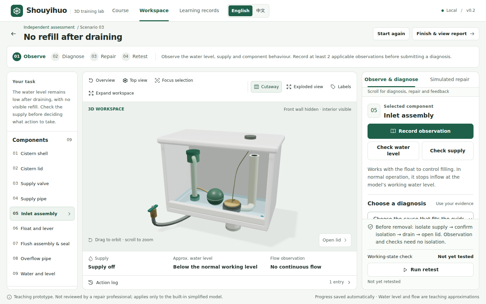

# Shouyihuo

**A local-first, interactive 3D training simulation with deterministic assessment rules.**

Shouyihuo (手艺活, “craft skills”) turns a small teaching scenario into an inspectable software system: a learner explores a simplified gravity-fed toilet cistern, gathers evidence, diagnoses a fault, performs simulated actions and verifies the result. The workbench runs in the browser, with no backend, account or API key.

**Local MVP v0.2 · Bilingual portfolio edition · English by default · 5 October 2026**

[Public source repository](https://github.com/echom5713-droid/shouyihuo)  
[中文运行说明](README.zh-CN.md) · [Technical case study](docs/portfolio/TECHNICAL_CASE_STUDY.md) · [Five-minute review guide](docs/portfolio/REVIEWER_GUIDE.md) · [Project brief (PDF)](docs/portfolio/Shouyihuo_Project_Brief.pdf) · [Validation evidence](docs/portfolio/VALIDATION.md)



*Actual English-interface WebGL capture from 5 October 2026. The application starts in English and supports an English / 中文 switch. [Validation](docs/portfolio/VALIDATION.md) separates bilingual checks from earlier runs.*

## What to inspect first

| Time | Review route | What it makes inspectable |
|---|---|---|
| 2 minutes | [Project brief](docs/portfolio/Shouyihuo_Project_Brief.pdf) | Scope, architecture, evidence and limitations |
| 5 minutes | [Run the walkthrough](docs/portfolio/REVIEWER_GUIDE.md) | A real observation-to-report interaction |
| 10 minutes | [Technical case study](docs/portfolio/TECHNICAL_CASE_STUDY.md) | State transitions, invariants, persistence and trade-offs |
| Deeper review | [Pure simulation engine](src/domain/engine.ts), [unit tests](tests/engine.test.ts), [browser flows](e2e/flows.spec.ts) | Whether the implementation supports the claims |

A bilingual review page is included at `/review/` when running the app locally. Both the review page and the working simulation open in English for a new visitor and expose an **English / 中文** switch. This makes the implementation directly reviewable alongside the English case study and project brief. No public live demo is implied by this repository.

## The engineering problem

A 3D teaching interface is only useful if its visible state and its assessment rules agree. A learner must not be able to repair a fault by changing the camera, remove an installed component after an invalid action, or erase a safety error by refreshing the page.

The prototype separates four responsibilities:

1. **Course configuration** specifies the built-in parts, evidence and three fault scenarios.
2. **A typed reducer** accepts events, enforces prerequisites and advances the simplified water model using controlled time steps.
3. **A presentation layer** derives the current learning stage and renders the same state in React and Three.js.
4. **Validated local persistence** restores attempts and archives completed records without duplicate entries.

This is a bounded software-engineering prototype. It is **not** computational fluid dynamics, a calibrated digital twin, a machine-learning system, a validated instructional intervention or a professional skills qualification.

## Working scope

- **Three deterministic cases:** drain-seal failure, inlet-control failure and a closed supply valve. The supply-valve case requires no component replacement.
- **Three modes:** structure exploration, guided practice and independent assessment. Independent assessment locks the first diagnosis; guided practice permits retries.
- **Real WebGL model:** procedural tank cavity, lid, inlet, float, drain, overflow, supply valve and water. Rotate, zoom, select, inspect a cutaway, explode the view, focus a part and look down into the tank.
- **Connected visual state:** water level, flow indicators, valve direction and component assembly reflect the reducer state.
- **A complete attempt:** observe → diagnose → simulate treatment → retest → explain the score → save locally.
- **Failure handling:** illegal disassembly is rejected and recorded, corrupt storage is reported, and unavailable WebGL has an explicit 2D fallback.
- **UI refinement:** stage-specific action hierarchy, persistent safety feedback, keyboard focus handling, responsive layouts and a workspace expansion that preserves the same attempt and Canvas.
- **Bilingual presentation:** English by default, with an English / 中文 switch for the application and review page. Language changes affect labels and explanations, not case IDs, events, assessment or progress.

The 25/30/25/20 score covers evidence, diagnosis, process and verification. Passing additionally requires at least 80 points, a correct diagnosis and repair, all applicable verification conditions and **no critical safety error**. A score of 100 can therefore still fail. [See the rule explanation](docs/portfolio/TECHNICAL_CASE_STUDY.md).

## Run locally

Tested environment: **Node.js 24.19.0 and npm 11.9.0 on Linux**. Exact dependency versions are pinned in `package-lock.json`. Use a compatible Node version from `package.json`; Node 24 is the straightforward choice.

From the directory containing `package.json`:

```bash
npm ci
npm run dev
```

Open [http://127.0.0.1:5173/](http://127.0.0.1:5173/) for the working application, or [http://127.0.0.1:5173/review/](http://127.0.0.1:5173/review/) for the English introduction. These addresses refer to the machine running the command. The development server listens on loopback only.

**Windows PowerShell:** open the extracted project folder in File Explorer, enter `powershell` in its address bar and press Enter. Run `npm.cmd ci`, then `npm.cmd run dev`. This avoids changing PowerShell execution policy. Stop with Ctrl+C; later restart with `npm.cmd run dev` from the same folder. See [the detailed Chinese instructions](README.zh-CN.md).

The first dependency installation needs the network. Once installed, the course, model, system-font interface and rules do not request remote assets or AI services. No Docker, Blender or Unity is needed.

## Reproduce the checks

```bash
npm run typecheck
npm run test
npx playwright install chromium
npm run test:e2e
npm run build
npm run preview
```

`npm run test` runs once. Browser tests start the local server themselves. On a Linux test host, Playwright may additionally need its documented operating-system dependencies. `PLAYWRIGHT_CHROMIUM_EXECUTABLE_PATH` can select an already installed Chromium; it is a test-host override, not an application requirement.

Use `E2E_SCREENSHOT_DIR` and `E2E_VALIDATION_DIR` to select new evidence directories instead of replacing the historical v0.2 captures. Shell-specific examples and the actual current results are in [Validation](docs/portfolio/VALIDATION.md).

The **5 October bilingual run** passed type checking, **47 unit tests**, **18 browser tests** and a production build. [Validation](docs/portfolio/VALIDATION.md) records the final production-preview status separately. Earlier September and pre-localisation October results remain dated historical evidence. Tests demonstrate the checked behaviours, not learning effectiveness or universal hardware compatibility.

## Source map

| File | Responsibility |
|---|---|
| [`src/domain/types.ts`](src/domain/types.ts) | Attempts, modes, cases, events, evidence and result types |
| [`src/domain/course.ts`](src/domain/course.ts) | Course content, parts and scenario definitions |
| [`src/domain/engine.ts`](src/domain/engine.ts) | Pure transitions, safety conditions, time stepping and scoring |
| [`src/storage/local.ts`](src/storage/local.ts) | Zod validation, recovery, persistence and idempotent archiving |
| [`src/ui/presentation.ts`](src/ui/presentation.ts) | Read-only stage and review-advice derivation |
| [`src/i18n/index.tsx`](src/i18n/index.tsx) | English-default locale context and local presentation translation; separate language preference |
| [`src/components/TankModel.tsx`](src/components/TankModel.tsx) | Procedural geometry, state rendering, camera and fallback |
| [`src/views/Workbench.tsx`](src/views/Workbench.tsx) | Interaction hierarchy, selection and expanded workspace |
| [`tests/`](tests/) / [`e2e/`](e2e/) | Rule-level checks and actual browser interaction |

The stack is Vite, React, TypeScript, Three.js, React Three Fiber, Zod, Vitest and Playwright. This portfolio edition does not upgrade the dependencies or replace the simulation engine.

## Learning records and boundaries

The learning-record storage key remains `shouyihuo.local.v1`, with `schemaVersion: 1`. Current attempts are separated by mode; completed attempts are deduplicated by ID. The display preference uses the separate `shouyihuo.locale.v1` key. Switching language does not create a new attempt, change safety errors, or rewrite a score. Keep the same browser profile and origin to retain your records. `localhost`, `127.0.0.1` and different ports have separate storage.

Records stay in the browser and are editable by its owner. The printable completion sheet is only a **local demonstration record**, not a tamper-resistant certificate, occupational qualification or permission to perform real repairs. No personal learning records are included in this repository; the compatibility fixture is synthetic.

The teaching content has **not been reviewed by a repair professional** and applies only to this simplified model. Water levels and timings are normalised teaching approximations, not measured engineering quantities. No learner study, physical validation, accessibility certification or claim of improved learning outcomes is made.

## Development provenance

The project brief and acceptance constraints were supplied by the project owner. **OpenAI Codex provided substantial implementation, documentation, testing and debugging assistance.** This repository should be assessed as an AI-assisted engineering artefact, not evidence of unaided solo coding. The available development record does not establish which implementation details the owner independently wrote or can explain.

[Provenance](docs/portfolio/PROVENANCE.md) identifies the supported contribution claims and review questions. [Publication scope](docs/portfolio/PUBLICATION_SCOPE.md) explains the public package and exclusions. University-specific application notes are kept outside the public repository. No university affiliation or endorsement is implied.
