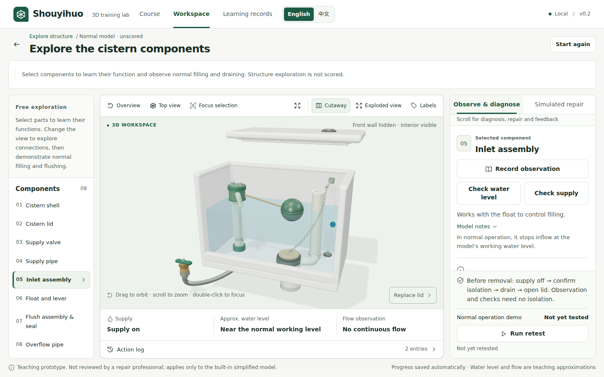

# Detail without another simulation

**Shouyihuo Local MVP v0.2 · 5 October 2026**

This iteration improves the existing procedural cistern and its inspection gestures. It keeps the course reducer, three scenarios, assessment rules and schema-v1 learning records intact. The [earlier rendering note](RENDERING_REFINEMENT.md) explains the demand loop; this note records the next visual refinement and what it can establish.

*Actual application capture. Structure exploration is unscored; this image is not evidence of a completed assessment.*

## Details that clarify construction

The shell now has a rounded upper rim and mounting fasteners with washers and rubber seals. The lid has an alignment lip and four underside pads; its existing single button has a recessed collar. The inlet receives unions, cap fasteners and outlet collars. The drain seat and overflow pipe are genuinely annular meshes: looking into an open mouth reveals a bore, rather than the closed end of a solid cylinder. The flapper has a hinge pin and a sealing lip.

The small parts remain children of the nine existing selectable components. Clicking a fastener or chain link selects its parent assembly; it does not introduce another repair task, component ID or scoring criterion. The details do not depend on the unknown fault before diagnosis, so they cannot silently identify an assessment answer.

The soft supply hose uses a **64×64 procedural normal map**, generated deterministically in memory. Repeat wrapping gives the surface a fine crossed weave. A normal map changes the response to light, not the tube silhouette; it is a visual approximation of a braided surface, not a pressure model or manufacturing specification. No texture, environment map, font or model is fetched from another host.

[`MechanicalDetails.tsx`](../src/components/model/MechanicalDetails.tsx) contains the reusable annular sleeve, fastener, thread-band and linked-chain primitives. Thread bands share an instanced mesh, as do the 39 alternating chain links. Instancing reduces repeated draw submissions within those details; it does not make their triangles free or establish a frame-rate improvement. The sleeve geometry and generated texture are explicitly disposed when their owners unmount.

## A fixed pivot for the float

The earlier ball and lever moved together vertically, allowing the lever to detach visibly from the inlet head. The revised presentation derives a ball position on a bounded circular arc around a fixed pivot. A constant-length rod is placed between that pivot and the ball centre. Water state drives the arc; the view never writes water or an inlet condition back to the reducer.

Visual interpolation moves the ball vertically and derives the other coordinate at every frame, preserving the arm length during the transition. Reduced-motion mode snaps to the same endpoint. The entire float-and-lever part follows the inlet's removed or exploded offset, so it does not remain behind when that assembly is separated for inspection.

The arm length is **1.62 model units**. Those units are chosen for illustration; they are not centimetres or engineering tolerances. The arc is bounded to avoid penetrating the lid. This is geometric coherence, not a force, buoyancy, friction or linkage-dynamics simulation. The local engine still decides when filling stops through the original simplified rules.

The chain now contains individual linked shapes and terminates at a small support arm. Its illustrative route clears the float's motion envelope. The flapper's rendered opening state raises the chain attachment during a simulated flush. The support and linkage are generic illustration details, not a claim that every real cistern uses this arrangement or a full physical representation of the button mechanism.

Visual review mattered here: the first normal-water capture revealed that a plausible-looking diagonal chain passed through the float. The route was corrected before final acceptance. A close-up also showed an excessively coarse hose pattern; its repeat density was increased and normal strength reduced for a finer finish. Those issues were found by opening actual rendered images, not by a successful TypeScript build.

## A small inspection gesture

**Double-click a mesh or visible component label to focus it.** The same component becomes the list selection, the inspector selection and, where applicable, the action target. A plain click still selects without moving the camera. The existing keyboard-operable **Focus selection** button remains the alternative; touch operation does not require a double click.

A camera command can carry the clicked part ID explicitly. This avoids relying on a React selection update finishing before the focus command reads its target. Camera commands, labels, cutaway, explosion and workspace expansion remain presentation state. They dispatch no `OBSERVE`, `REMOVE`, `REPLACE`, `RETEST` or completion event, and cannot change an attempt's evidence, diagnosis, errors or score.

The gesture hint is translated into English and Chinese. The desktop toolbar gains no new button. The expanded workspace retains the same mounted Canvas and returns with Escape. The 2D fallback continues to identify itself clearly; camera gestures are not presented as a working substitute for WebGL.

## Verification and its limits

The [dated validation report](portfolio/VALIDATION.md) links the actual executions, screenshots and production-preview check for this iteration. The new browser tests use ordinary user actions:

- Double-click the canvas at a projected mesh position, confirm the focused part and corresponding action target, then change display controls and locale while comparing protected attempt state and score.
- In unscored structure exploration, turn off supply, flush and restore supply. Read the rendered rod and ball world transforms to check a fixed pivot, constant arm length and a rod tip attached to the ball during changing water states.

The geometric check reads actual Three.js mesh transforms, including parent assembly offsets. It is stronger than checking the text water readout alone, but it still validates software geometry rather than calibrated physical equipment. The previously existing real-user workflows, safety-failure report, persistence tests and demand-loop checks are retained.

A [14-file integrity comparison](validation-model-detail-2026-10-05/core-integrity.json) covers the course, reducer, types, persistence, dependency files, original test journeys, unit tests and stage/locale logic. The baseline is public commit `a6fb4636874e236ea815c157e1b58bb7863bad22`. This is a scoped comparison; model, workbench presentation, translation copy, documentation and the new browser tests do change.

Screenshots are inspected at 1440×900, 1366×768, 1280×800 and 390×844. Software WebGL is real rendering, but it does not demonstrate native-GPU performance, physical touch usability, instructional effectiveness or repair accuracy. Extra geometry increases scene cost; the renderer still sleeps after visible changes settle. No dependency upgrade, asset service or external model pipeline was introduced.

## Questions for a technical review

1. Why does a rigid arm require deriving the second ball coordinate throughout interpolation?
2. How do local and world transforms differ when the parent assembly is exploded or removed?
3. What does instancing reduce, and what costs remain?
4. Why can normal-map detail look convincing while the silhouette stays unchanged?
5. How can a camera gesture target the wrong part if it relies on asynchronously updated selection?
6. Which visual claims require checking a rendered scene rather than only unit tests?

This is substantially AI-assisted work. The [provenance statement](portfolio/PROVENANCE.md) distinguishes the owner's product requirements from Codex's implementation and verification. A supporting application should describe contributions that can be substantiated; richer geometry does not establish unaided authorship or scientific-model validity.
