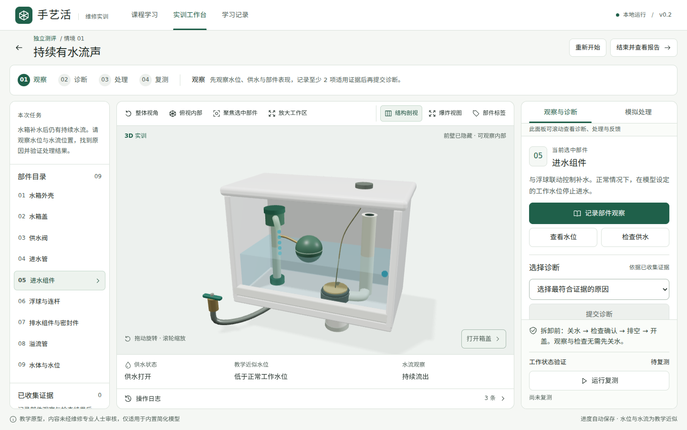
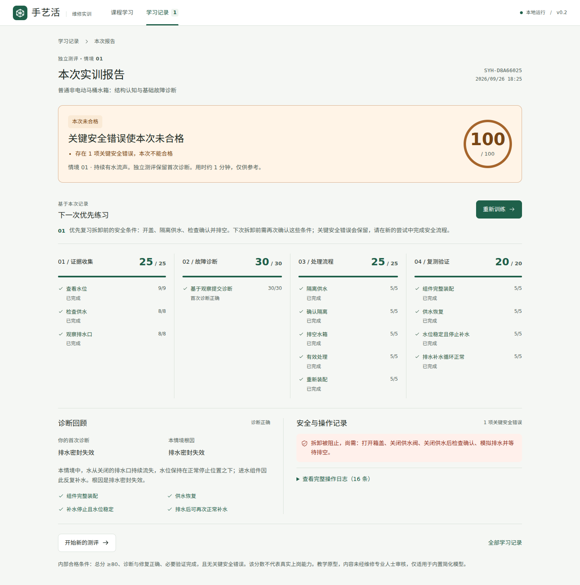

# Shouyihuo: a rule-driven 3D training prototype

**Version:** Local MVP v0.2  
**Documentation prepared:** 5 October 2026  
**Scope:** a browser-based teaching model of a simple gravity-fed toilet cistern. The application interface is in Simplified Chinese; this case study and the [reviewer guide](REVIEWER_GUIDE.md) are in English.

Shouyihuo connects an interactive 3D model to a deterministic training simulation. A learner observes symptoms, collects evidence, submits a diagnosis, performs simulated actions, runs a working-cycle test, and receives an explainable report. Its main engineering problem is keeping the visual model, permissible actions, assessment rules, and saved progress consistent.

This is a teaching prototype, not a digital twin or real repair guidance. Its content has not been reviewed by a repair professional. The three scenarios apply only to the built-in simplified model. [Provenance and AI assistance](PROVENANCE.md) describe how the project was produced.

*Historical v0.2 browser screenshot, captured during the 26 September 2026 validation. The model is rendered with WebGL, not a background image.*

## 1. A deliberately bounded system

The model has a float-controlled inlet and a flapper-style drain seal. It supports three deterministic cases:

| Observable symptom | Built-in cause | Applicable treatment |
|---|---|---|
| Continuous flow after filling | Failed drain seal | Isolate and confirm the supply; empty the tank; open the lid; remove, replace, and reinstall the drain component; restore supply |
| Water rises to the overflow | Inlet control failure | Apply the same safety sequence to the inlet component, then restore supply |
| No refill after draining | Closed supply valve | Inspect and restore the supply; component replacement is unnecessary |

Each case requires a successful working-cycle retest. The third case is useful because it prevents the training flow from equating every fault with component replacement.

Three modes share this model: unscored structure exploration, guided practice, and independent assessment. Independent assessment presents symptoms and general part descriptions before diagnosis. It does not automatically highlight the faulty component or show a case-specific missing-evidence checklist. It explains the cause only after a diagnosis is submitted. These are presentation rules, not protection against inspecting the client-side source.

## 2. Architecture: one authoritative attempt

| Layer | Responsibility | Source |
|---|---|---|
| Course configuration | Part descriptions, symptoms, evidence requirements, correct diagnoses | [course.ts](../../src/domain/course.ts) |
| Domain types | Attempt state and discriminated event union | [types.ts](../../src/domain/types.ts) |
| Simulation and scoring | State transitions, action guards, water approximation, retest, score calculation | [engine.ts](../../src/domain/engine.ts) |
| Persistence | Schema validation, local storage, idempotent archiving | [local.ts](../../src/storage/local.ts) |
| Presentation derivation | Current stage and prioritised review suggestions | [presentation.ts](../../src/ui/presentation.ts) |
| Application and workbench | Route/session ownership, event dispatch, controls and feedback | [App.tsx](../../src/App.tsx), [Workbench.tsx](../../src/views/Workbench.tsx) |
| 3D view | Procedural geometry, selection, camera and visual interpolation | [TankModel.tsx](../../src/components/TankModel.tsx) |

The `Attempt` stores supply state, water level, component installation/replacement state, defects, evidence, diagnosis history, process flags, safety errors, logs, retest checks, and completion status. The reducer accepts typed events such as `CHECK_SUPPLY`, `REMOVE`, `DIAGNOSE`, and `TICK`.

The 3D scene reads this attempt. It does not decide whether a repair succeeded, award points, or keep a second copy of the fault state. Selecting a mesh, a part-list entry, or the operation selector updates the same selected-part value. Camera and display settings are separate transient UI state.

The model does interpolate displayed water and component positions between updates. That smoothing is a rendering concern; the reducer's values remain authoritative.

## 3. Deterministic simulation, with explicit limits

The application dispatches `TICK` with a simulation increment of 0.25 seconds. The reducer rejects non-finite or non-positive increments, caps an individual increment at one second, and integrates the water approximation in internal steps of at most 0.05 seconds. A simple inflow/outflow balance changes the normalised water level, with a normal operating threshold and an overflow cap.

These are teaching units. There is no calculation of pressure, pipe friction, seal deformation, tank volume, or calibrated engineering time. The browser timer is not an accurate wall-clock simulator: a throttled background tab can slow progress. Retest phase transitions are evaluated on each dispatched tick, so the determinism claim is **the same initial state and the same event sequence produce the same result**, not arbitrary time schedules being interchangeable in every intermediate state.

The retest checks filling, holding a stable level, simulated draining, and automatic refilling. It fails when supply or assembly requirements are absent, overflow occurs, or the model does not reach a stable level within its bounded simulation interval. Successful completion records assembly, supply, stability, and cycle checks.

Attempt IDs and timestamps are supplied at creation. Their generation is separate from scoring; random identifiers do not make assessment outcomes random.

## 4. Invariants matter more than a progress animation

The reducer enforces the following rules, with focused tests in [engine.test.ts](../../tests/engine.test.ts):

- Removing an installed component requires an open lid, closed supply, confirmation of isolation, and completed drainage. A rejected action leaves the component installed, records feedback and a log entry, and retains the relevant safety error.
- Closing the supply changes water behaviour but does not clear a defect.
- Replacing the wrong component does not remove the actual fault.
- Restoring supply while either component is absent is rejected and records a critical safety error.
- Repair alone cannot pass: assembly, restored supply, and the complete applicable retest are required.
- Changing the working state after a passed retest invalidates that verification.
- Completed attempts ignore later reducer events. Starting again creates a new attempt rather than rewriting an archived result.

Safety errors are deduplicated by code, while rejected attempts remain visible in the action log. Camera resets, panel changes, and page refreshes cannot clear a stored safety error.

## 5. Explainable scores and a separate pass gate

| Section | Points | Calculation |
|---|---:|---|
| Evidence | 25 | Awarded once for each applicable observation; integer shares total 25 |
| Diagnosis | 30 | 30 for a correct first answer; guided correction can earn 15; an incorrect locked assessment answer earns 0 |
| Process | 25 | Case-specific steps; the supply case does not require removal or replacement |
| Verification | 20 | Four retest checks worth 5 points each |

At least two applicable observations are required before diagnosis. Independent assessment locks the first submitted answer. Guided practice permits a different answer but preserves the first response and its scoring consequence. Repeated evidence, diagnosis submission, or successful retesting cannot add extra points.

`scoreAttempt` derives its result from the attempt rather than incrementing a mutable score counter. Passing also requires a total of at least 80, correct diagnosis, effective treatment, complete assembly, restored supply, a passed retest with all checks, and no critical safety errors.

This distinction is visible in the report: **a score of 100 can still be a failed assessment**. The report uses the pass gate, not the numeric score alone, to choose its result treatment and certificate eligibility. A successful guided attempt does not issue the independent-assessment completion certificate.

*Historical browser evidence from 26 September 2026. The unsafe removal was blocked; completing the later repair did not erase it.*

## 6. Local persistence and its trust boundary

The store retains the v0.1 key `shouyihuo.local.v1` and `schemaVersion: 1`. It contains an optional nickname, an active session for each mode, and completed records. Zod validation checks nested fields and basic consistency, including completed-record state, session-mode agreement, and duplicate record IDs.

Malformed, incompatible, or unavailable storage produces a recoverable UI state. Reset requires explicit confirmation and removes only this project's key. `archiveAttempt` ignores exploration, unfinished attempts, and already archived IDs; it removes only the matching active session. This makes repeated completion/refresh handling idempotent within the local application.

This is local convenience, not an audit system. Browser storage can be edited or deleted; validation is not cryptographic integrity or a complete proof of semantic history. The application has no accounts, server backup, synchronisation, or formal certification authority. The printable completion record explicitly states these limitations.

## 7. 3D and interaction trade-offs

The scene uses programmatic Three.js geometry through React Three Fiber: a hollow tank, lid, supply valve, inlet pipe and assembly, float and linkage, drain/seal assembly, overflow tube, and water. It needs no downloaded model, remote font, texture, or environment map at runtime.

The v0.2 work refined materials, lighting, camera framing, and labels. Camera commands include overview, top view, and deliberate focus on the selected part. Focus framing considers the component's bounding-box corners and the camera aspect ratio. Labels project from model anchors, prioritise the selected component, and suppress problematic overlap or occlusion.

Exploded and cutaway views are observational transforms: they do not mark components as removed or bypass removal guards. Expanding the workspace reuses the same Canvas and attempt. Opening the lid is an actual model event, so it remains distinct from a camera command.

The implementation favours responsive procedural illustration over photorealism. Reduced-motion settings affect visual transitions; a clear interactive 2D fallback is provided when WebGL is unavailable. The fallback preserves access to rule-based training but is not counted as successful 3D validation.

## 8. An observed regression and the corrective loop

During the v0.2 browser run, changing viewport size exposed a genuine layout failure: the Canvas container's percentage sizing expanded a grid track and the footer intercepted clicks on **运行复测** (“Run retest”). Playwright could locate the button but could not perform a normal click.

The correction constrained the grid row with `minmax(0, 1fr)`, allowed the model workspace to shrink with `min-height: 0`, set a bounded flex basis for the model stage, and positioned the Canvas wrapper within that stage. The test retained a real click; it did not use a forced click to hide the obstruction. The complete suite was then rerun.

Evidence: [preserved failure context](../validation-v0.2/regression-found/retest-footer-overlap.md), [failure screenshot](../validation-v0.2/regression-found/retest-footer-overlap.png), [current CSS](../../src/style.css), and [E2E scenarios](../../e2e/flows.spec.ts). This example shows why successful compilation is insufficient evidence for an interactive application.

## 9. Verification and remaining uncertainty

The historical validation dated **26 September 2026** reports successful type checking, **40 unit tests**, **12 E2E tests**, a production build, and a production-preview check. These are dated results, not a claim that those commands were rerun when this English document was prepared. The separately dated [portfolio recheck](VALIDATION.md) records the 5 October run. See the [full original validation report](../TEST_REPORT.md) and [production-preview evidence](../validation-v0.2/production-preview.json).

The browser evidence used Linux Chromium with a real WebGL 2.0 context backed by ANGLE/Vulkan SwiftShader. It covered real Canvas selection, all three complete scenario paths, persisted records, a 100-point safety failure, old-store compatibility, fallback behaviour, and desktop/narrow-screen layouts. It did not establish native-GPU performance, Safari/Firefox support, real touchscreen usability, physical printing, or learning effectiveness. No participant study or professional repair-content review has been conducted as part of this work.

The most useful next evaluations would be expert review of the course assumptions, observed learner usability sessions, and testing on representative hardware. Their results should be reported as new evidence rather than inferred from the current automated tests.
